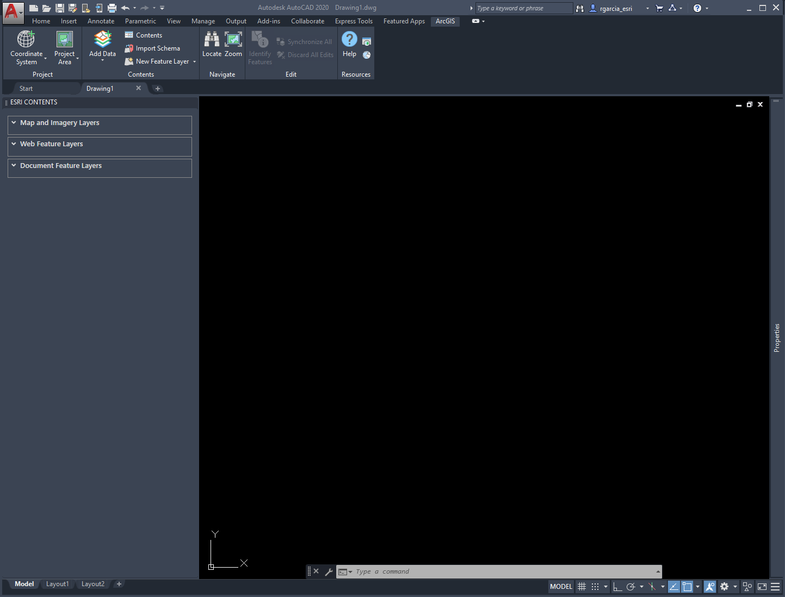
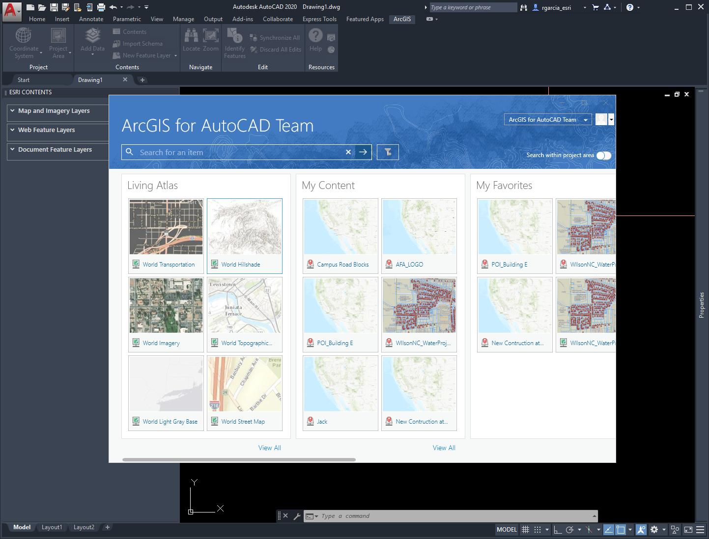
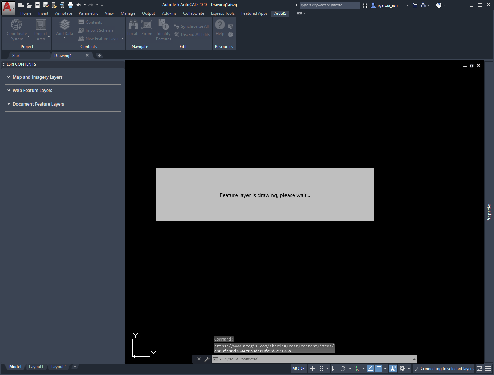
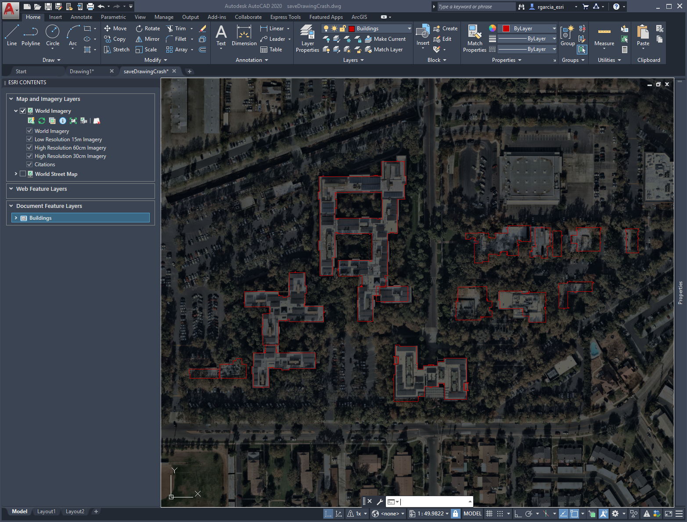
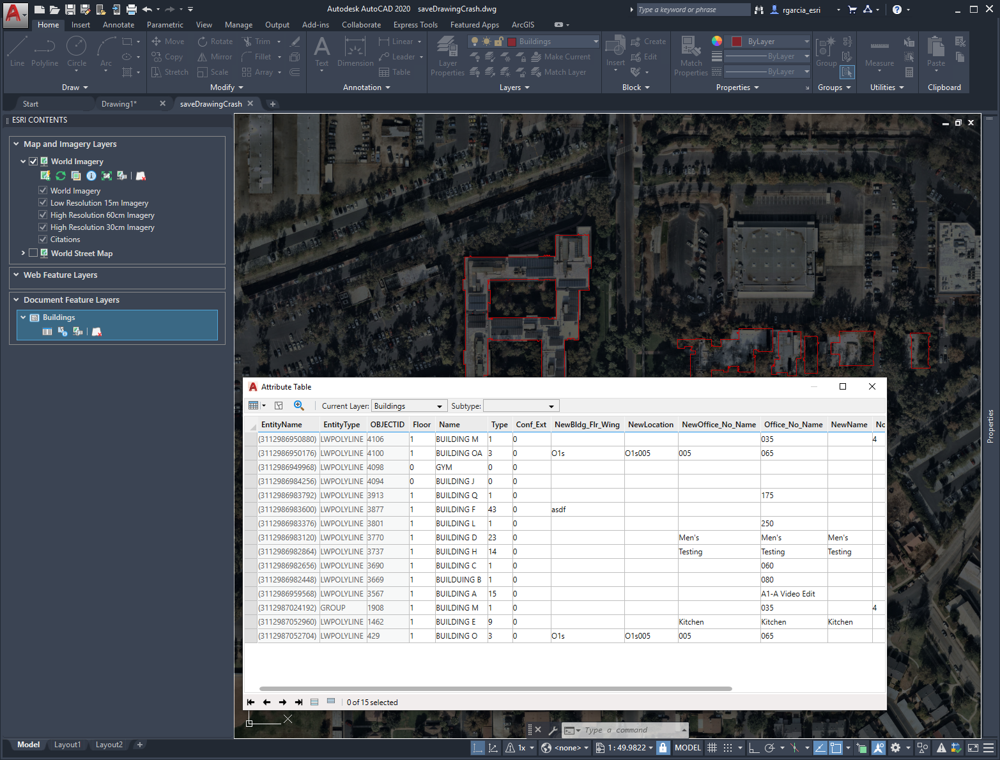
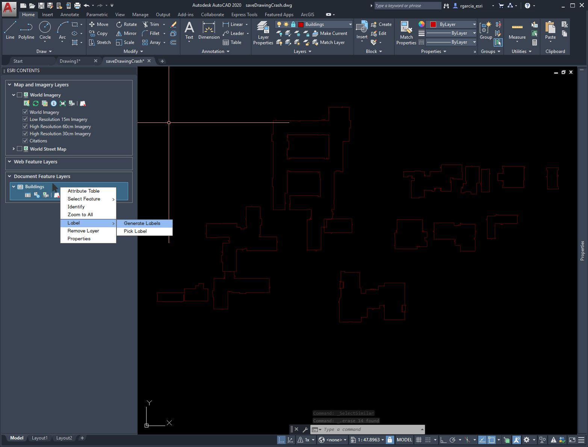
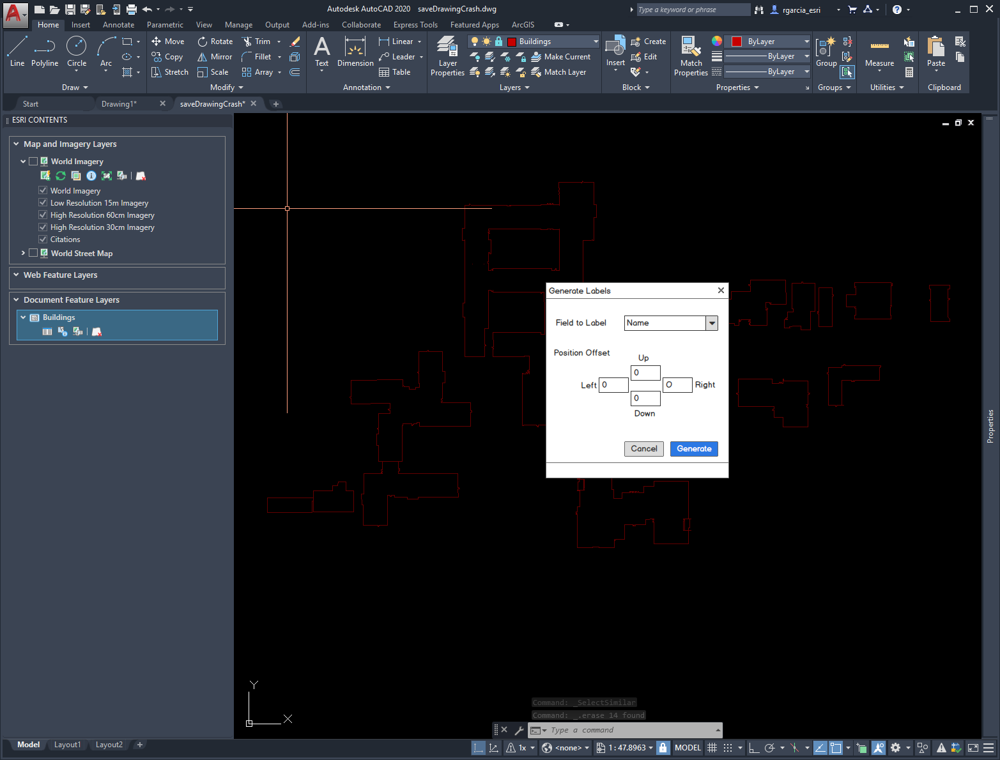
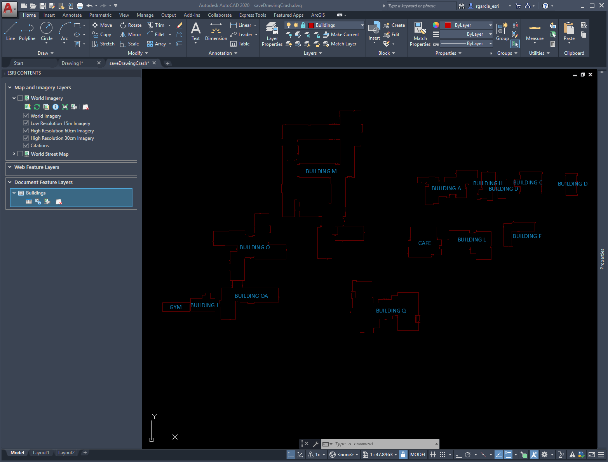
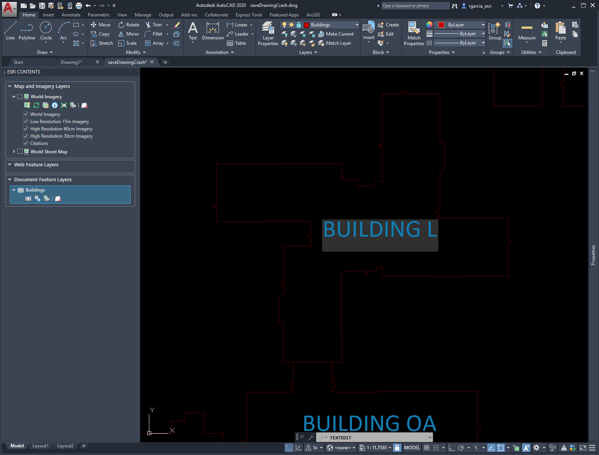
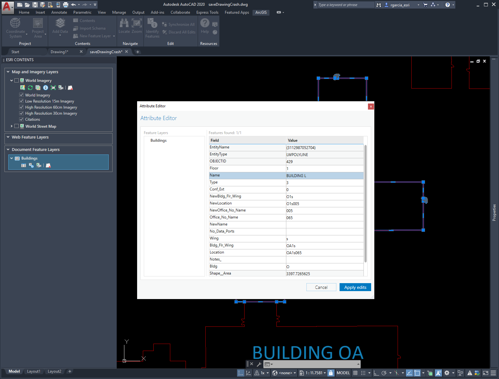

Before I get to deep into creating the user interface of the Label Generation tool I wanted to run through some examples and questions of how this would work and if it makes sense. Follow the screenshots and notes below to help give me a better idea of how I should proceed. 

The prerequisites to running this tool will be to have [Autodesk AutoCAD](https://www.autodesk.com/products/autocad/overview) version 2017-2020 and [Version 400 of ArcGIS for AutoCAD](https://earlyadopter.esri.com/key/ArcGISforAutoCAD ) installed

## Step 1: Start AutoCAD with ArcGIS for AutoCAD installed

This is the default view of AutoCAD with ArcGIS for AutoCAD installed. 

## Step 2: Add data to your CAD file
Data can be in the form of local data or data from a feature service. This data needs to be registered as apart of a feature class with attribute information.
Local data: Use Export to CAD in ArcGIS Pro/ArcMap or Create a Document Feature Layer using ArcGIS for AutoCAD. 

For the purpose of this test we are going to use data from a features service hosted on ArcGIS Online

Select the layer you want and wait for it to load

The feature service, in this case outlines of buildings on the Esri Campus, will be added as attributed CAD features. I also added a map just to make it clearer (not needed for the test)

The following view shows the attribute table, peeking into the attributes attached to each feature. This data is the same data that lives in the feature service. 

## Step 3: Start the AutoLabeling tool
This is where the start of functionality for the label generation begin. Everything before this is current ArcGIS for AutoCAD functionality. 

Actions on feature layer in ArcGIS for AutoCAD are performed through the AutoCAD command line or through the Esri Contents pane, analogous to the contents pane in ArcGIS. Right Clicking on a layer will give you all the options that can be performed on a layer. Navigate to the "Labeling" section and select "Generate Label" this will open the Label Generation UI. 

**Question #1: Does the location from which the tool is initiated make sense? Is it obvious that the tool exists?**

## Step 4: Interact with the Generate Label UI 
The options in the tool are simple, I don't want to provide too many options in this window. Most of the stylization of the label entities can be performed by using AutoCAD tools, I want to stray from duplicating functionality. 

**Question #2: Do you think more options are needed ?**

**Question #3: Is it clear what is going to happen when you close this window?**

**Question #4: Does the positioning section make sense?**

## Results
After the labels are generated your features will be generated, they will be AutoCAD mtext entities with the values from the field you selected to be labeled. 

The label values are now linked. If you make a change to one of the generated text objects, the value of the GIS attributed it is lined to will also update.

